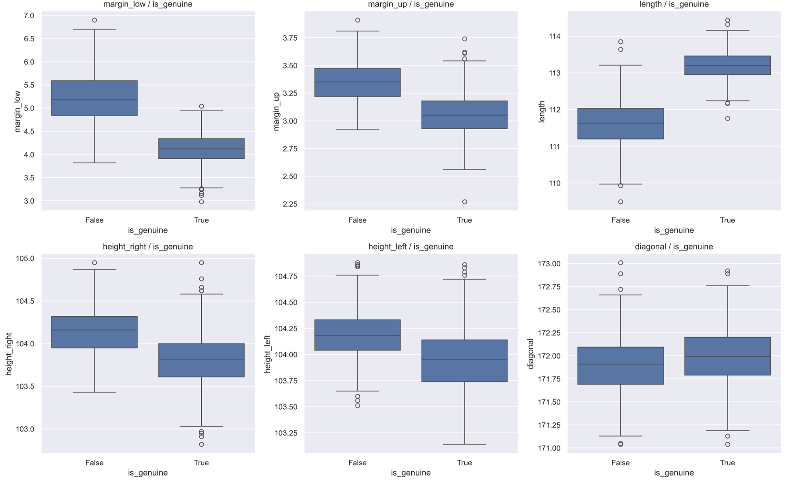
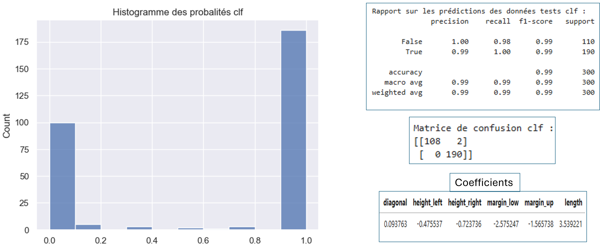
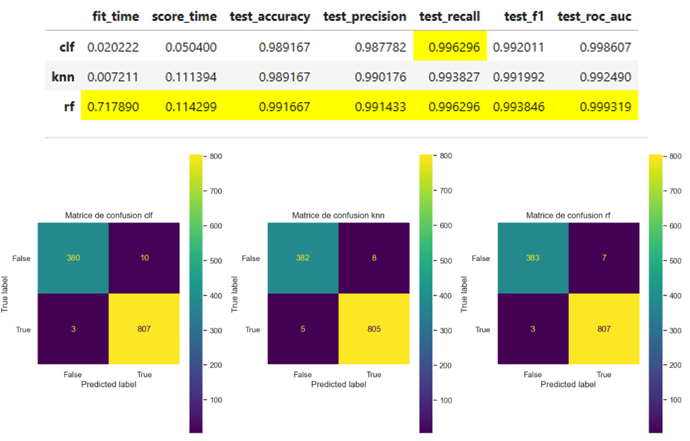
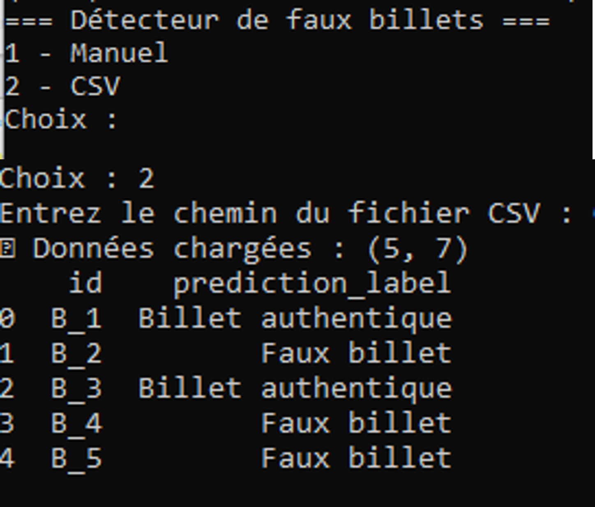

# 🤖 Détection de faux billets – Machine Learning

## 🎯 Objectif
Développer un modèle prédictif permettant d'identifier les faux billets

---

## 🧠 Travail réalisé

- Analyse exploratoire des données (EDA)

- Visualisation et interprétation statistique
- Traitement des valeurs manquantes
- Analyse des corrélations (Pearson / Spearman)
- Détection et gestion de la multicolinéarité (VIF)
- Préparation des données pour la modélisation
- Construction et comparaison de modèles de machine learning

- Sélection du modèle le plus performant

- Évaluation des performances (accuracy, précision, rappel)
- Sauvegarde et industrialisation du modèle (pickle)

---

## 🛠️ Outils

- Python (Pandas, NumPy)
- Scikit-learn
- Matplotlib / Seaborn
- Statsmodels (VIF)
- Pickle

---

## 📈 Résultats

- Modèle prédictif entraîné et validé sur les données
- Identification des variables les plus discriminantes
- Pipeline complet de data science : exploration → préparation → modélisation → évaluation → industrialisation
- Modèle réutilisable via sérialisation (pickle)

---

## 👤 Auteur
Yoann De Cler
